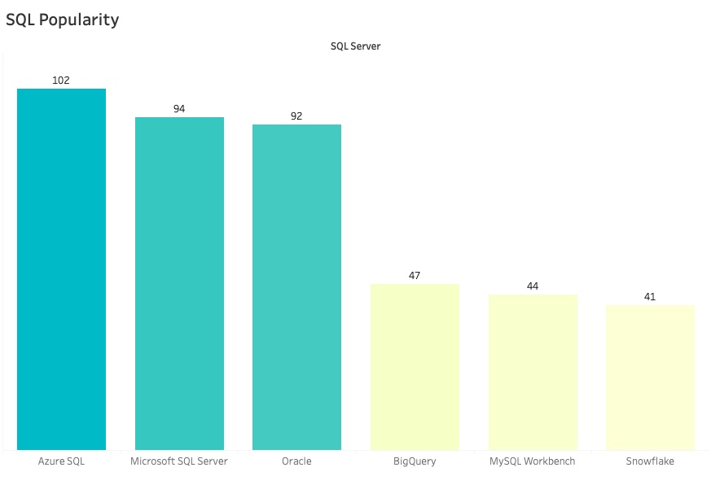
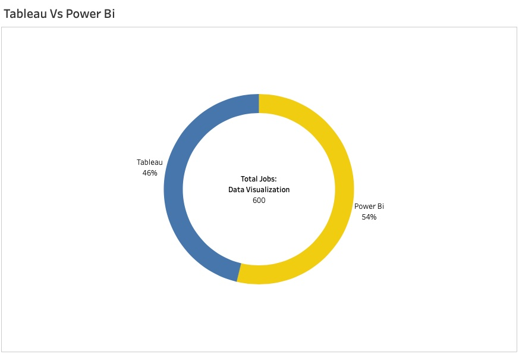
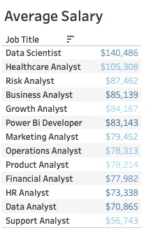

# Nhut Vo's Github Data Portfolio - The-Analyst-Job-Dataset  

## **Executive Summary:**

Hello datafam,

This data analytics github porfolio is based on real world data found from the job market. I've gathered various job listings from different job board websites like LinkedIn, Indeed, WorkInTexas, and much more sites. Compiling the data found into SQL format, I've created a database with three tables featuring all the data from the job market. These datas are my findings that should help job seeker navigate the job market. I hope to share my insights with both employers and employees. 

* Collected real world data and transformed them into meaningful insights
* Used key performance indicators (KPIs) to measure the performance of our organization
* Analyzed clean data to solve business problems and point out key insights best for business decision
* Turned data into tables, charts, graphs, and dashboards to share with stakeholders my data visualization findings

## **Business Problem:**

Employers and job seekers are having a difficult time finding the right match for each other. Imagine the job market is like using a dating app, two potential partners are trying to find the perfect match for each other. As an analyst, we must find insight in the data that both sides needs from each other. One side needs employees, while the other side needs an employer, but both parties must find chemistry from the other to have a successful business impact.

## **Methodology:**

1. Top SQL skills job seekers needs to match the employer's requirements.

2. Which data visualization tool is more pupular with employers? Tableau or Power BI?

3. Job seekers needs to know the average salary in the U.S. that employers are willing to pay for analytics jobs positions.

## **Exploratory Data Analysis (EDA):**

* Business Question/Problem - Exploration of data through descriptive analysis answering stahkeholders questions and solving business problems.
* Data Collection & Storage - Investigating data to discover patterns, spot abnormalities, check assumptions, and store cleaned data into relational database.
* Data Analysis Insights - Explore the many possibilities for data analysis through the insights gathered from the collected dataset.
* Data Visualization & Storytelling - Summarize the values within our data using visual representations and clear story presentation to the audience.
* Business Decisions - Understand the business, stakeholders, and data to make impactful decisions best suited for the company.

>## **Project: Data Analytics Job Market**

#### [SQL - Relational Database Creation](https://github.com/vovo007/Analytics-Job-Market-Dataset/blob/main/Relational%20Database%20Creation)

#### [SQL - Business Insights Query Syntax of Employers & Employees](https://github.com/vovo007/Analytics-Job-Market-Dataset/blob/main/Business%20Insights%20Query%20Syntax%20of%20employers%20%26%20employees)

#### [Tableau - The Analytics Job Market Dashboard](https://public.tableau.com/app/profile/nhut.vo4927/viz/RealAnalytics_17510476448520/USAAnalyticsJobMarket)

#### [Google Sheets - Descriptive Statistic Spreadsheet of Data Job Market](https://docs.google.com/spreadsheets/d/1aMNPwsyd4bShYQ5i-sCUdZC9Ooc08vARtZB10GSquRE/edit?usp=sharing)

Thanks for stopping by:

